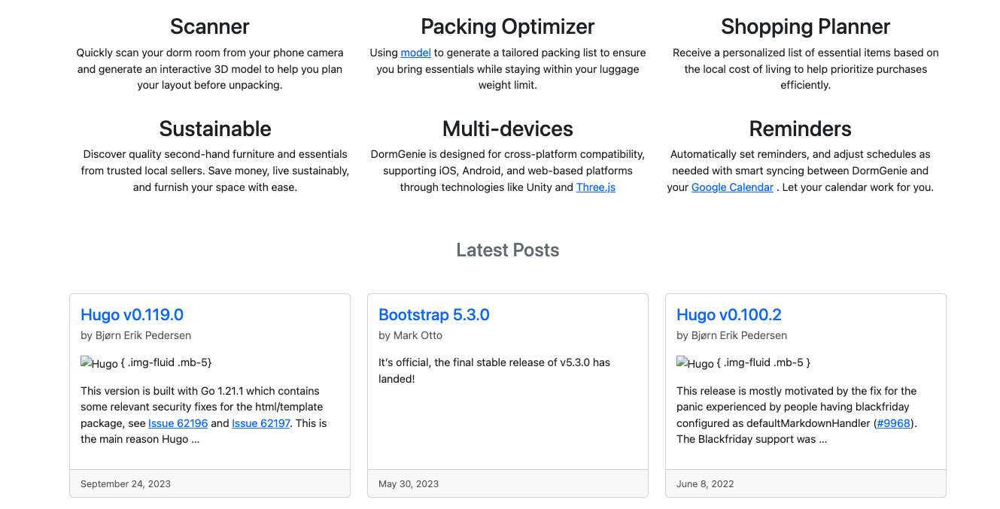

# Issue Report: Image Rendering Behavior in Hugo

## **Problem Summary**
When running the `hugo server -D --disableFastRender` command:
- **Sub-repo (original Hugo Bootstrap theme)**: Images render correctly.
- **hugo-mock-landing-page repo**: Images do not render, leaving placeholders or broken image spaces.

This inconsistency raises questions about the cause of the rendering differences between the two repositories.

---

## **Steps to Reproduce**

1. Navigate to the sub-repo and run:

```
cd /themes/hugo-bootstrap-theme/exampleSite
hugo server -D --disableFastRender
```

 -  Images are rendered correctly on the locally served website.
 
  

2. Navigate to hugo-mock-landing-page and run:

```
cd hugo-mock-landing-page
hugo server -D --disableFastRender
```
-  Images do not render correctly, leaving empty placeholders.

 


**My thought**
1. firstly I could make sure that I already download 
` @filipecarneiro/hugo-bootstrap-theme` and `npm` and `node.js` by using 
```
npm -v
node -v
```

2. basically I follow the instruction in `readme.md` in original theme repository except for `themesdir = "node_modules/@filipecarneiro"` since our HW1 instruction need us to delete this line
3. I couldn't find where the figure that need to be render is, thus I have no idea how to solve this issue now

Thank you for taking the time to review this issue and for any feedback you can provide. Your help is greatly appreciated! 😊

-----
**For those who see this issue afte Feb 6th,2025**:
I resolved this issue by inspecting the webpage using the browser’s Inspect Tool and verifying that all image paths are correctly located. To do this, I toggled the Inspect Element Mode using Command + Shift + C. 

Additionally, I ensured that the submodule configuration was correctly set up to avoid deployment issues.

There is a tip for solving this problem:

To copy the contents of the sample site to your main site (e.g., hugo-mock-landing-page), use the following command:
`cp -r . ../../[destination-path]`

---
## Acknowledgments  
Special thanks to [Prof.Jérémie Lumbroso]([https://github.com/johndoe](https://github.com/jlumbroso)) for valuable support and advice!
